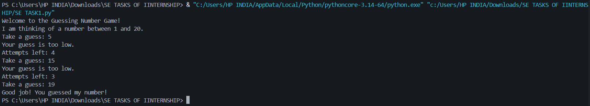
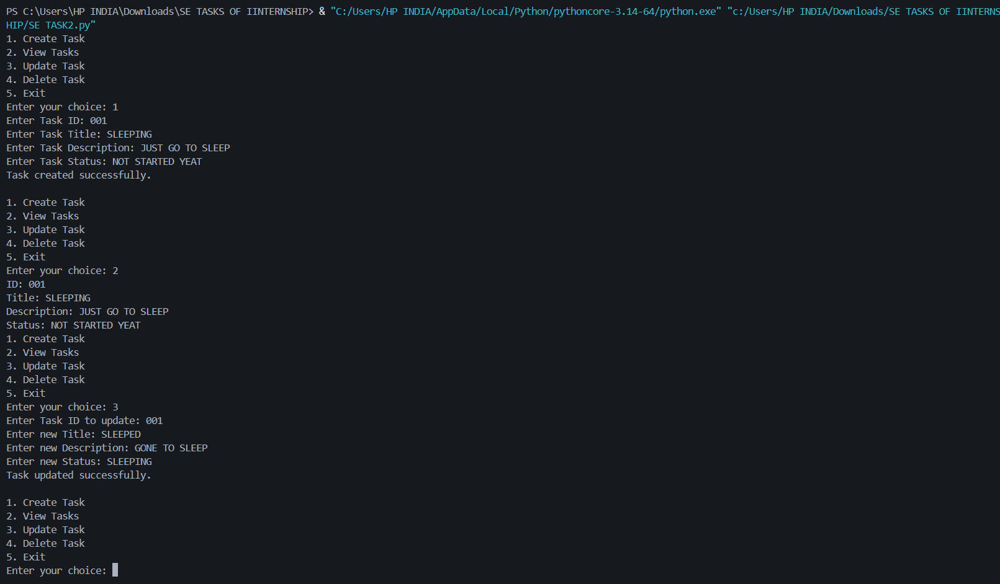
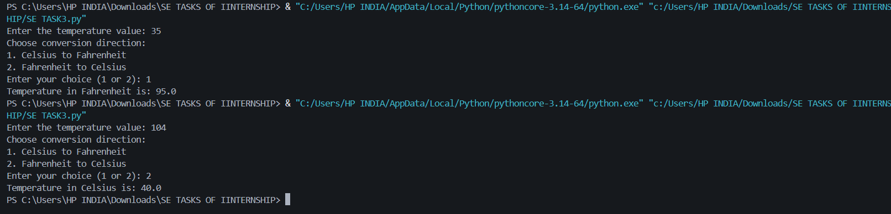
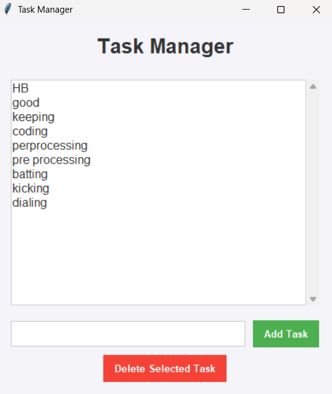

# Cognifiers Software Engineering Internship - February 

This repository contains the projects and tasks I developed during my Software Engineering Internship at **Cognifiers** in February. The tasks range from basic command-line utilities to a fully functional Graphical User Interface (GUI) application, demonstrating progression in Python programming, Object-Oriented Programming (OOP), and GUI development.

## 🛠️ Tech Stack
* **Language:** Python 3.x
* **Libraries:** `tkinter` (for GUI), `random` (for logic)
* **Concepts Applied:** CLI development, CRUD operations, Object-Oriented Programming (OOP), File I/O, GUI implementation.

---

## 📂 Projects Overview

### Task 1: Number Guessing Game (`SE LVL1.py`)
A simple, interactive Command-Line Interface (CLI) game where the computer randomly selects a number between 1 and 20, and the player has 5 attempts to guess it. The program provides hints ("too high" or "too low") after each guess.

* **Key Features:** Random number generation, while loops, conditional logic.
* **Output:**


### Task 2: Console-Based Task Manager (`SE LVL2.py`)
A CLI application that allows users to manage a to-do list using CRUD (Create, Read, Update, Delete) operations. This project implements Object-Oriented Programming (OOP) by utilizing a `Task` class to structure the data.

* **Key Features:** Class and object instantiation, lists for in-memory storage, interactive menu loop.
* **Output:**


### Task 3: Temperature Converter (`SE LVL3.py`)
A straightforward CLI utility that converts temperatures between Celsius and Fahrenheit based on user input. 

* **Key Features:** User input handling, mathematical operations, simple UI flow.
* **Output:**


### Task 4: GUI Task Manager (`SE LVL4.py`)
A fully functional Graphical User Interface (GUI) application built using Python's `tkinter` library. It allows users to add and delete tasks visually. Importantly, this application includes data persistence by saving and loading tasks from a local `tasks.txt` file.

* **Key Features:** `tkinter` widgets (Listbox, Entry, Buttons, Scrollbar), event binding, file handling (`open()`, `read()`, `write()`), error handling (`try-except`).
* **Output:**


---

## 🚀 How to Run the Files

1. Ensure you have Python installed on your system.
2. Clone this repository:
   ```bash
   git clone <your-repository-url>
